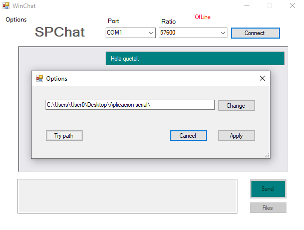

Esta es una aplicación desarrollada en el curso de comunicación de datos, universidad nacional de Trujillo.

## Descripción
La aplicación permite comunicarse a través del envío de mensajes y archivos empleando los puertos de comunicación serial. 
-Permite seleccionar la velocidad en baudios y el puerto por el que se va a comunicar.

